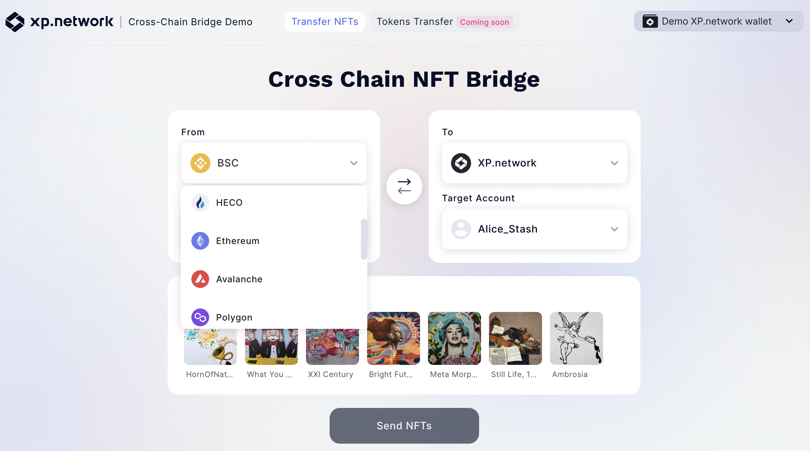
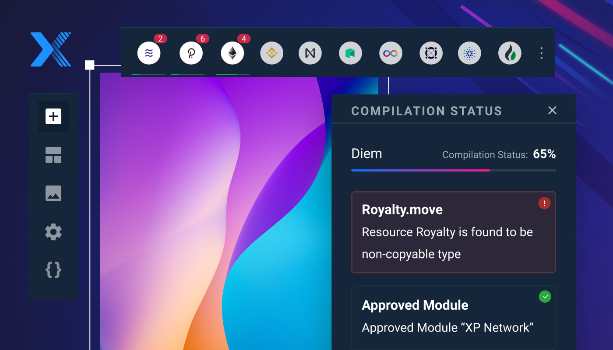

import Tabs from '@theme/Tabs';
import TabItem from '@theme/TabItem';

# Home

#### XP Network in a nutshell

## The first NFT Multi-bridge connecting 10+ distributed ledgers

XP.network is the first blockchain-agnostic NFT ecosystem. It enables multichain support out of the box for any minted NFT, dApp, or use case, allowing NFTs and funds to flow freely between networks and wallets.

## Build NFT dApps without code on 10+ blockchains

XP.network is the very first no-code NFT development platform allowing creators and entrepreneurs alike to build and deploy quality NFT dApps without having to write a single line of code.

:::info
## [01. WHAT IS XP NETWORK?](./what_is_xp_1_introduction)
:::
:::info
## [02. MULTIBRIDGE](./multibridge_1_overview)
:::
:::info
## [03. DEVELOPER RESOURCES](./developer_resources)
:::

## Keep up to date!

<Tabs
  defaultValue="Telegram"
  values={[
    { label: 'Telegram', value: 'Telegram', },
    { label: 'Twitter', value: 'Twitter', },
    { label: 'LinkedIn', value: 'LinkedIn', },
    { label: 'Medium', value: 'Medium', },
    { label: 'Website', value: 'Website', },
    { label: 'GitHub', value: 'GitHub', },
    { label: 'Reddit', value: 'Reddit', },
  ]
}>
<TabItem value="Telegram">
<a href="https://t.me/xp_network">t.me/xp_network</a>
</TabItem>

<TabItem value="Twitter">
<a class="twitter-timeline" href="https://twitter.com/XPNetwork_?ref_src=twsrc%5Etfw">twitter.com</a> 
</TabItem>

<TabItem value="LinkedIn">
<a href="https://www.linkedin.com/company/xp-network/">www.linkedin.com</a>
</TabItem>

<TabItem value="Medium">
<a href="https://blog.xp.network/">blog.xp.network</a>
</TabItem>

<TabItem value="Website">
<a href="https://xp.network/">Tearing down walls between blockchains</a>
</TabItem>

<TabItem value="GitHub">
<a href="https://github.com/xp-network">github.com</a>
</TabItem>

<TabItem value="Reddit">
<a href="https://www.reddit.com/user/XP_network/">www.reddit.com/user/XP_network/</a>
</TabItem>

</Tabs>
