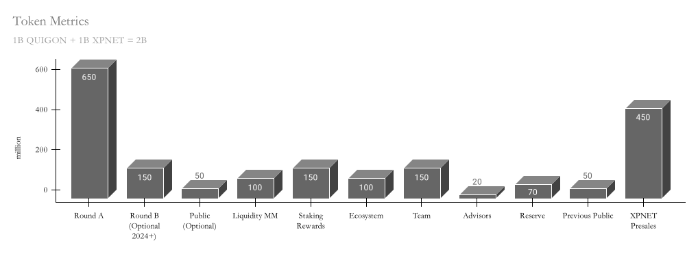
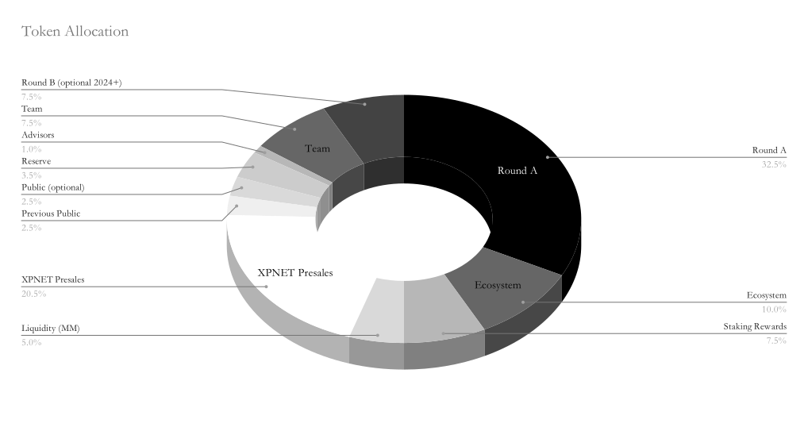
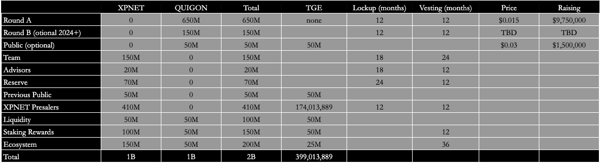

# 
XP.NETWORK Token Utility

$XP.NETWORK is the native token of XP.NETWORK. It is used for transaction fee payment, staking, and to encourage further development of XP.NETWORK; $XP.NETWORK runs on BSC – one of the fastest and most efficient blockchains, widely used by Defi and NFT applications.

**Token Metrics**

The updated token metrics comprise the breakdown related to $XPNET & $XP.NETWORK. The maximum supply of tokens is one billion each, hence the two billion unified pool.

$XPNET Smart Contract (BSC): 0x8cf8238abf7b933Bf8BB5Ea2C7E4Be101c11de2A

$XP.NETWORK Smart Contract (BSC): TBN

**Token Allocation**

The initial public sale of $XPNET (the previous name of the token) was held on September 14, 2021, on three launchpads: BSCPad, Occam.Razer. The initial CEX was held on Gate.io. Earlier seed and private rounds were equally sold out. In particular, XP.NETWORK’s seed round was backed by well-known players such as Wings Capital, Master Ventures, Kosmos VC, Walsh Wealth Group, and 15 more funds. The token was traded on PancakeSwap and Gate.io at the time of writing.

**Token Vesting Schedule**

**Staking**

$XP.NETWORK token holders can stake the token for 3, 6, 9, or 12 months 2, 3, 4, 5 years and earn an APY of 45%, 75%, 100%, 125%, 250%, 375%, 500%, 650% respectively. XP.NETWORK’s staking program is unique in the decentralized landscape due to the bonuses in the form of discounts and cashback while using XP.NETWORK Bridge & XP.NETWORK Aggregator.

**XP.NETWORK Staking & Cashback**

Owners of the XP.NETWORK token can stake their tokens in the Aggregator Staking smart contract and receive a cashback reward called rebate on their account. The higher is the stake, and the longer the locking period, the higher the rebate.

Another benefit the XP.NETWORK staking provides to its owner is lower transaction fees while purchasing and bridging the NFTs to the user’s account. Following the same logic. The higher the staked amount and the longer the staking period, the more significant the rebate.

Users who do not own XP.NETWORK tokens are also eligible for receiving the rebate while using the Aggregator but at the lowest possible rate.

In all cases, the Aggregator and the Bridge will automatically stake the assigned tokens for the users. The stake amounts will gradually accumulate to provide better discount rates and higher rebates in the following deals. The staked XP.NETWORKs can be withdrawn at the end of the staking period.

**Staking Benefits**

The benefit of the token holders grows with the growth of the stake amount and the length of the period it is staked for.

| Amount of staked XP.NETWORK | Bridge Rebate (% of TX fee) | Aggregator rebate  (% of the NFT price) |
| :-------------------------: | :-------------------------: | :--------------------------------------------: |
|         0.00 - 1499         |            0.001            |                     0.001                      |
|        1’500 - 2’000        |              2              |                      0.2                       |
|      N = 2’001 & above      |         2 + N/5’000         |                    N/10’000                    |

**Staking Period Multiplier**

Period of staking works as a multiplier for all the benefits the stake provides.

|  Period  | Multiplier |
| :------: | :--------: |
| 90 days  |    1.03    |
| 180 days |    1.06    |
| 270 days |   1.075    |
| 365 days |   1.125    |
| 2 years  |     2      |
| 3 years  |     3      |
| 4 years  |     4      |
| 5 years  |     5      |

For example, if a user staked 3000 $XP.NETWORK for 2 years the benefits will be as following:

Bridge rebate example (assuming the TX fee is $2):   

$2 * (2 + 3’000/5’000) * 2 => $2 *5.2% = $ 0.104 worth in XP.NETWORK
  

Aggregator rebate example (with an NFT worth $ 1’000):   

$1000 * (3’000/10’000) * 2 => $1000 * 0.6%=$6 worth in XP.NETWORK

**Where Can You Stake**

XP.NETWORK token is available on all the chains connected by the XP.NETWORK Bridge. XP.NETWORK is the only fungible token the bridge transfers. The blockchains where staking can be made will grow with every new integrated chain. The initial networks available for staking will be:

- Ethereum
- Binance Smart Chain
- Solana
- Avalanche
- Polygon
- Tron
- Elrond
- Algorand
- Tezos
- Fantom
- xDai
- Fuse

**Free staking**

The staker should pay the fee for the staking transaction according to the local rates of the blockchain selected for staking. The only place where XP.NETWORK can be staked for free is QuiChain.
