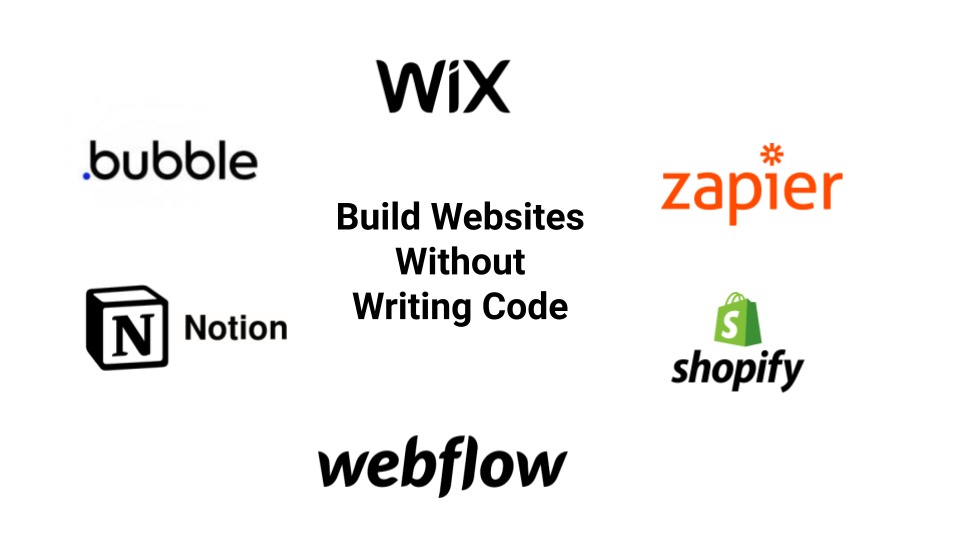
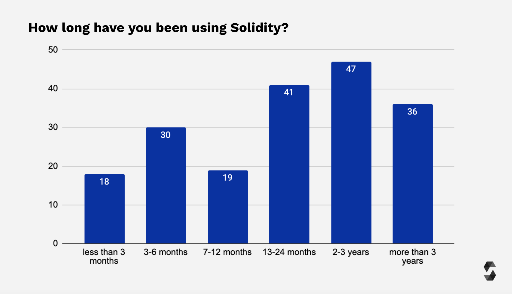
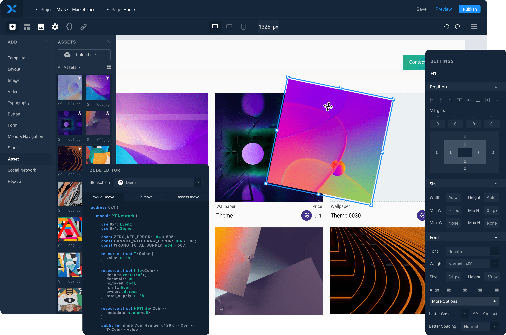

# Introduction

## The rise of no-code application development

No-code development platforms have progressed in leaps and bounds over the last decade, with the popularity of platforms such as Wix, Webflow, and Shopify skyrocketing, allowing anyone with a laptop and internet connection to start a website or e-commerce store in a matter of hours.

In recent times more advanced and sophisticated tools such as Bubble provide users with the ability to deploy websites with ease, leading to the proliferation of the term Citizen Developers: non-developers who build apps without professional help.

## Limitations of developing a dApp on a blockchain

The blockchain space, however, is still at an early stage, and the majority of smart contract development is restricted to programming languages such as Solidity (a variant of JavaScript).

As a result, due to the exponential increase in demand for dApp development, and a shortage of qualified Solidity developers, projects have to contend with either paying a high cost for a developer or securing a developer with less experience, which can increase the risk of flaws in the underlying smart contract code being developed.

While there were already no-code tools for building MVPs and prototypes outside of blockchain, even the simplest dApp required founders to pay Solidity developers tens of thousands of dollars.

Building an MVP still requires knowledge of smart contract architecture, so the challenge for non-tech founders remains. Compare this to AirBnB, the founder had a brilliant idea: let tourists stay for free in one's home. Air mattresses in their own apartment, a basic website, and a first booking. This was the MVP, and it didn't cost a fortune to develop.

## XP.NETWORK: No-code for blockchain

XP.NETWORK is turning things around for non-tech founders and product teams, it is one of the first blockchain projects to allow non-programmers to create quality NFT dApps on any blockchain thanks to a user-friendly drag-and-drop editor.
Using XP.NETWORK is easier than using WordPress, our platform allows entrepreneurs and founders to regain control of their user experience as well as their costs.

**Non-tech friendly**: Non-technical developers can create fully functional NFT dApps in any language without writing any code, additionally, by leveraging our proprietary Compliance Validator, developers can easily check the underlying code for errors based on built-in logic.

**Developer-friendly**: At the same time, we don't wish to alienate talented developers, so seasoned blockchain developers also have tools at their disposal to use XP.NETWORK. The Migration Module allows developers to edit any code generated in the smart contract editor and developers can also write in their preferred language (Solidity, Rust, Move or Ink!) and deploy to a blockchain that uses a different language.
