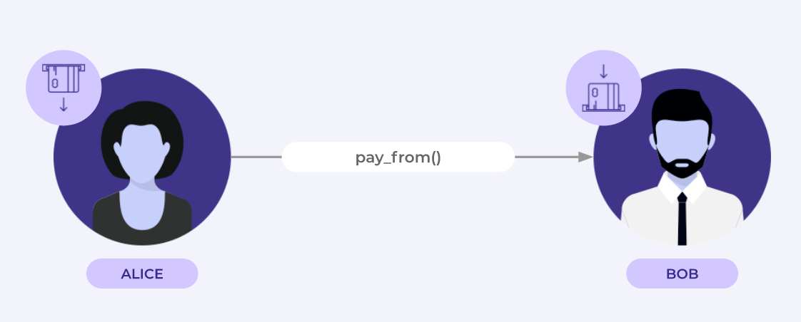
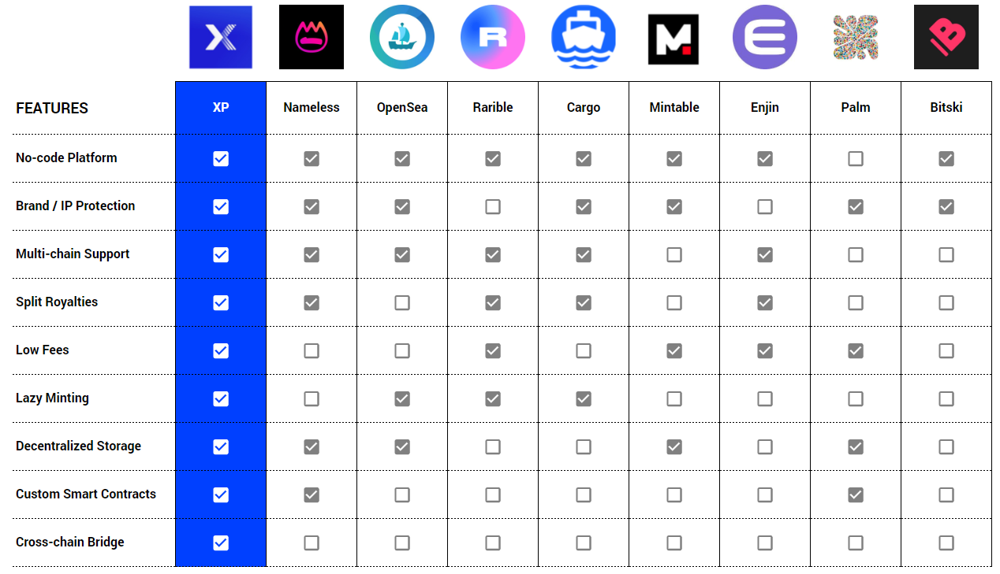

# How is XP.NETWORK Different?

## How is XP different from other NFT minting solutions?

XP.NETWORK combines the power of Polkadot's Parachain and Substrate architecture to deliver an all-in-one solution to address problems plaguing today's NFT platforms whilst at the same time making it easy and seamless for anyone to launch an NFT collection in a matter of clicks.

The primary advantages of building on XP.NETWORK are as follows:

:::tip
**No-code Tools** - Our no-code tools, such as our Application Editor, are second to none, whilst also offering a high degree of customization via our Smart Contract Editor to also satisfy seasoned blockchain developers.
:::

:::tip
**Multi-chain support** - Being built as a Polkadot parachain, we have native support of multiple chains (EVM and non-EVM compliant) and as a result offer a larger toolset for NFT dApp developers to work with. This is in contrast to most other NFT minting platforms which mainly only feature Ethereum Layer 2 scaling solutions.
:::

:::tip
**NFT Rights Retention on Other Blockchains** - By offering multi-chain support we will also be able to gate access to NFT assets and ensure that when they are used or consumed by users of other blockchains, the IP owners will be rewarded with the commensurate royalties.
:::

:::tip
**Cross-chain Bridge** - The first project to offer a fully native cross-chain bridge for NFT Assets, allowing users to seamlessly move NFTs from one blockchain to another.
:::

:::tip
**Security** - Not only do we have the advantage of being built on the Polkadot blockchain that contains advanced security and role-based access features thanks to Rust, but we have also built our very own Compliance Validator module as part of our NFT dApp development suite to enable users to stress-test their dApps for bugs and security issues prior to full release.
:::

## Built on Move

Move is a next generation Turing-complete smart contract language for secure, sandboxed, and formally verified programming. Move allows developers to write programs that flexibly manage and transfer assets while providing security and protection against attacks on those assets.

The main reasons why we have chosen Move are the following:

### **1. Rust & Access Control**

Move is written in Rust - a modern memory safe by architecture system programming language since Move inherits all the benefits of Rust out of the box.
In Move, any custom asset can be declared as a resource type, making it safe and access-controlled by default. This feature allows for the maintenance of ownership information and privileges of digital assets, even within smart contracts.

### **2. Bytecode Verifier**

Unlike most other smart contract languages Move's IR (Intermediary Representation, aka opcode) is verified before being deployed on the chain or executed.

### **3. Atomic Resource Architecture**

Move enforces the developer to define custom resource types that cannot be copied or implicitly discarded. The resources can only be moved between the program storage locations, hence the name of the language.

### **4. Modules**

In Move a smart contract is split into modules and scripts. Modules act as libraries where the resource types (schemas for the global storage) and the functions that can mutate those resources are defined. Nothing that has not been defined in a module can mutate the resources belonging to this module. The modules themselves are also stored in global storage.

### **5. Scripts**

Scripts are not stored in global storage and are there to call the functions of the modules like the main function calls the other functions in most programming languages.
Each transaction on the network may contain a script that can call several modules or initiate several actions. Developers can use one transaction to engage a number of actions which significantly reduces the number of smart contracts required for an application. This results in safer applications, better user experience, and significantly more flexibility.

## Competitive Advantage

The following table summarizes the competitive advantages of XP.NETWORK vs other NFT-as-a-service platforms:

