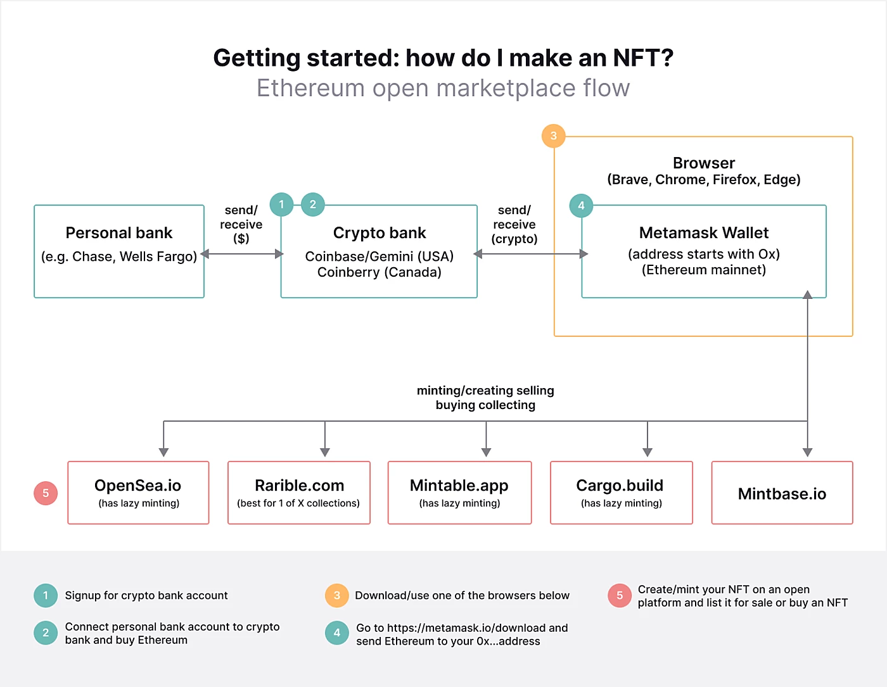
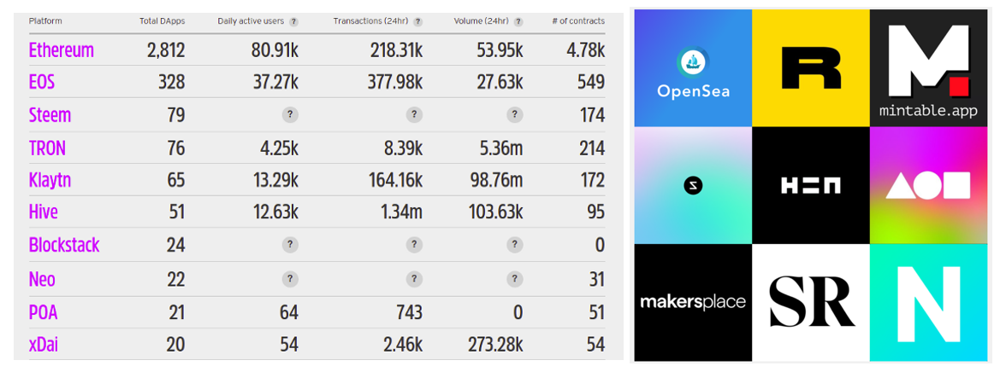
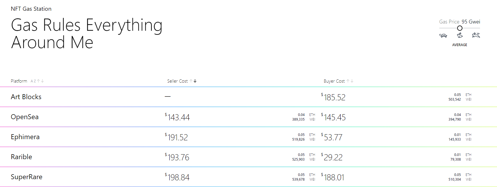
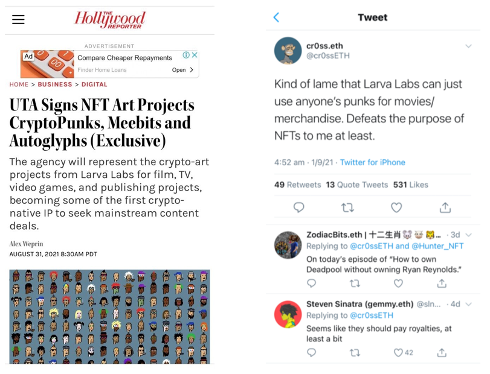
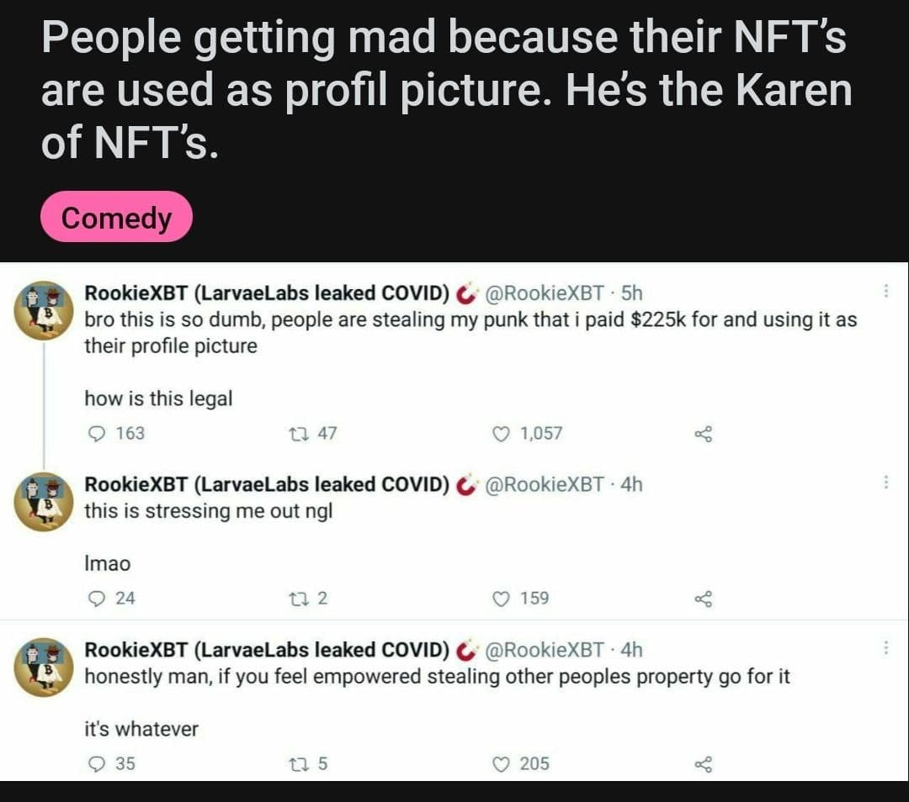

# Problems with today's NFTs

Today's NFT platforms and solutions suffer from a number of problems that don't provide either IP owners or NFT holders with sufficient rights or confidence around the security of their assets.

## Hard to easily create an NFT project
Whilst there are some tools that exist to make creating an NFT project easier, they do not possess all the features and functionality required to address an entrepreneur or brand's requirements in one solution. 

Most NFT projects are faced with a number of decisions and need to make a number of trade-offs in terms of speed v/s decentralization in order to launch their product. These can include;

+ Choice of the base layer to issue NFTs (gas)
+ Where to store NFT images 
+ Where to store NFT metadata
+ Where to list NFTs for sale
+ How to grant IP rights to NFT holders

## Limited Composability / Chain specific

The NFT minting and marketplaces that exist today are very much siloe'd and for the most part exist on the Ethereum blockchain, as a result they are impacted by the limitations of the Ethereum main chain. There is also no way to seamlessly transfer NFT assets between chains such as XTZ, FTM and ETH.

## High Gas Fees

Most NFT minting platforms to this day primarily operate on the Ethereum main chain, resulting in high minting, selling and buying fees.

## No IP Rights for NFT Owners

Whilst many projects indicate that the purchaser of the NFT owns the image, many of their licensing and commercial terms have limited rights and don't allow the NFT owner to have a say about where or how their NFT is used.

## Public image storage on IPFS

Whilst IPFS may be decentralized, image assets are publicly viewable as long as you have access to the token URI and underlying image URL. As a result, IP owners and NFT holders alike are powerless to stop unlicensed use of their NFT assets.

