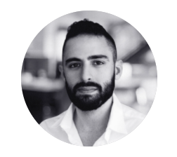
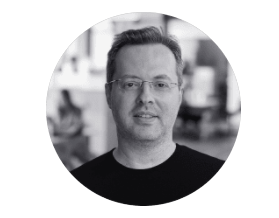
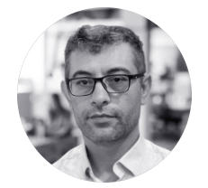
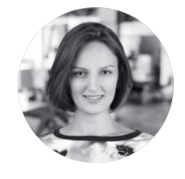
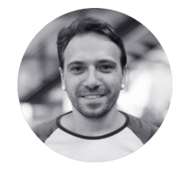
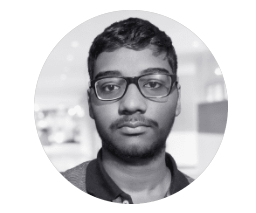
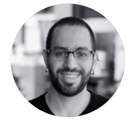
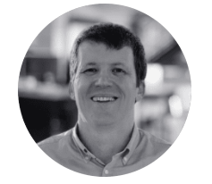
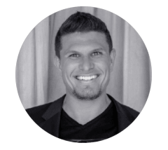

# Team

Meet the visionary leaders, experts, and professionals behind the first blockchain-agnostic NFT ecosystem.

## 
Leadership Team

### <a href="https://www.linkedin.com/in/nir-blumberger-714168155/">Nir Blumberger - CEO & Co-Founder</a>

    

Former executive at AmaZix, Former executive at Firmo (acquired by eToro).

### <a href="https://www.linkedin.com/in/dmitry-briukhanov-60b2ab45/">Dima Briukhanov - CTO</a>

    

Years of development experience in C, C++, Rust and Solidity.

### <a href="#">Verbal Kint - Engineer & Co-Founder</a>

    

Blockchain engineer. Built a successful Ethereum dApp. Extreme prototyper, Move and Rust enthusiast.

### <a href="https://www.linkedin.com/in/dimaulyanov/">Dmitry Ulianov - COO</a>

    

Senior team leader. 12 years of impeccable team managing experience in high-tech companies and international brands.

### <a href="https://www.linkedin.com/in/idan-bar-shalom-2ba03b85/">Idan Bar Shalom - CFO</a>

    

CPA. Former CFO at Firmo (acquired by eToro).

### <a href="#">Yaron Levy - Operations & Legal</a>

    

Adv. Yaron Levy is a seasoned lawyer experienced in commercial law.

## 
Development Team

### <a href="https://www.linkedin.com/in/daniel-mittelstadt-317008156/">Daniel Mittelstadt - Product Architecture</a>

    

Seasoned product architect, expertise in heavily regulated markets.

### <a href="https://www.linkedin.com/in/julia-prototskaya-84a15238/">Yulia Prototska - Art director</a>

    

Leading XP design. On the mission of making blockchain technology accessible and easy to use.

### <a href="https://www.linkedin.com/in/beekeyyy/">Brian Colon - Parterships & Growth</a>

    

Growing the XP ecosystem. Building partnerships, KOL relations and head of the Ambassadorship program.

### <a href="#">Reuven Bitton - Full Stack Engineer</a>

    

Reuven has 15+ years of experience in developing backend systems

### <a href="https://www.linkedin.com/in/alex1mosh/">Alex Moshinsky - Front End Developer</a>

    

Passionate for user-friendly web and mobile applications

### <a href="https://www.linkedin.com/in/rupansh-sekar-10941b16a/">Rupansh Sekar - Blockchain Engineer</a>

    

DevOps, C/C++, Solidity, TypeScript, Python and Rust developer

### <a href="#">**Waseem Ahmed Tunio** - Senior Full Stack Software Engineer</a>

    

Experienced user interface developer

### <a href="https://www.linkedin.com/in/michael-dagan-155320209/">Michael Dagan - Community Lead</a>

    

Social and communication expert

### <a href="https://www.linkedin.com/in/gregory-chapman-112460144/">Greg Chapman - Community Manager</a>

    

Building a strong relationship with our community on all socials.

### <a href="https://www.linkedin.com/in/loredana-dobre-stupurac-854260183/">Loredana Stupurac - Community Manager</a>

    

Building a strong relationship with our community on all socials.

### <a href="#">Alisa Orlova - Content</a>

    

Heading messaging and communication across all channels.

## Advisors

### <a href="https://www.linkedin.com/in/stasoskin/">Stas Oskin</a>

    

Stas has 15 years of experience in IT engineering, development, and project management. Previously founded Wing.ai and Dfinance, Co-Founder of Pontem Network.

### <a href="https://www.linkedin.com/in/sheridanhammond/">Sheridan Hammond</a>

    

Sheridan founded the Australian investment firm Kosmos Ventures, focused on helping promising blockchain startups scale and integrate their technology into our common future. Kosmos Ventures was among the early backers of Algorand, Solana and Polkadot.

### <a href="https://www.linkedin.com/in/kylechasse/">Kyle Chasse</a>

    

Kyle is a blockchain industry veteran, a prominent Bitcoin investor since 2013, and a sought-after keynote speaker. Kyle invested in projects like Kraken, Coinbase, Bitfinex, and others. He founded Master Ventures, a blockchain advisory firm that has worked Tier-1 startups such as UBANX, Spl.yt, and PAID Network