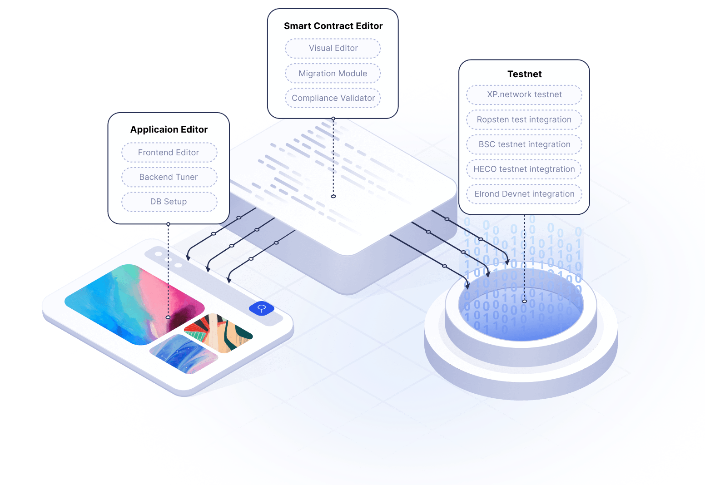
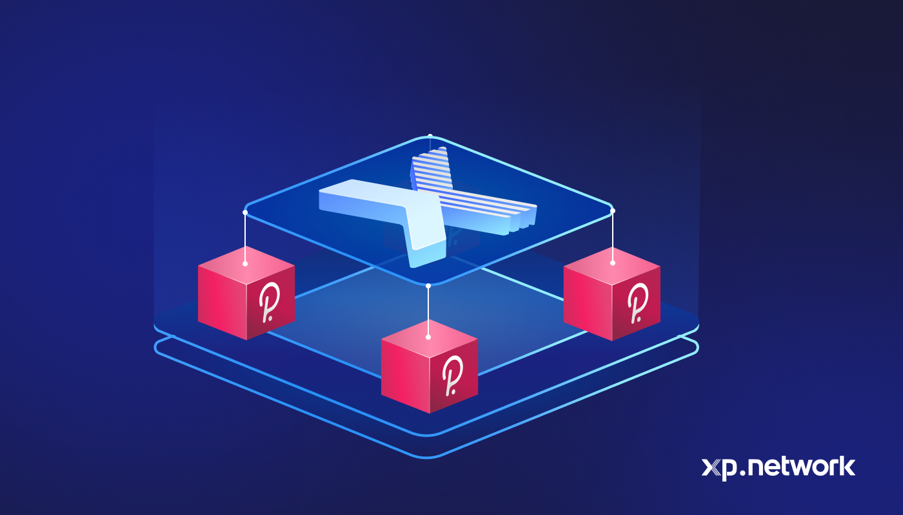
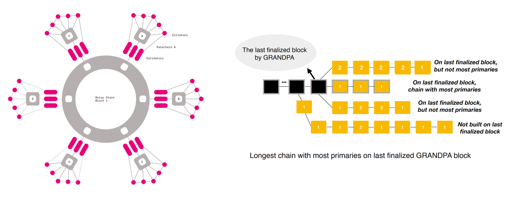
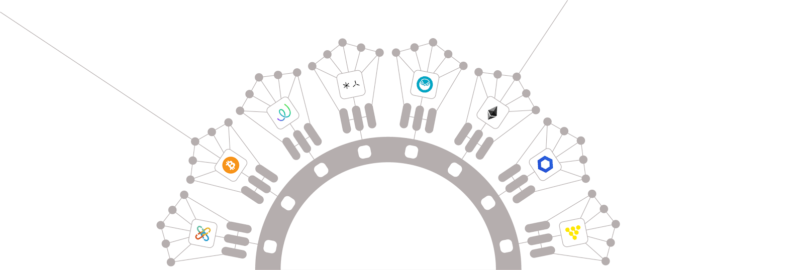
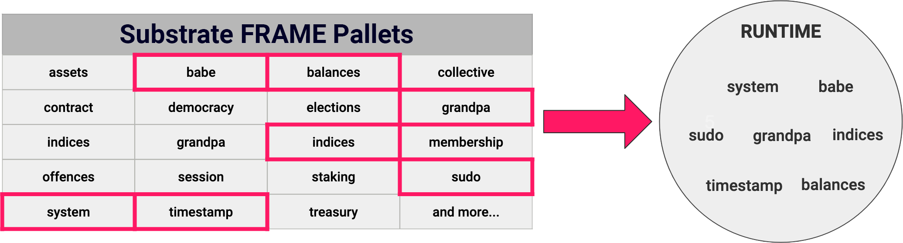
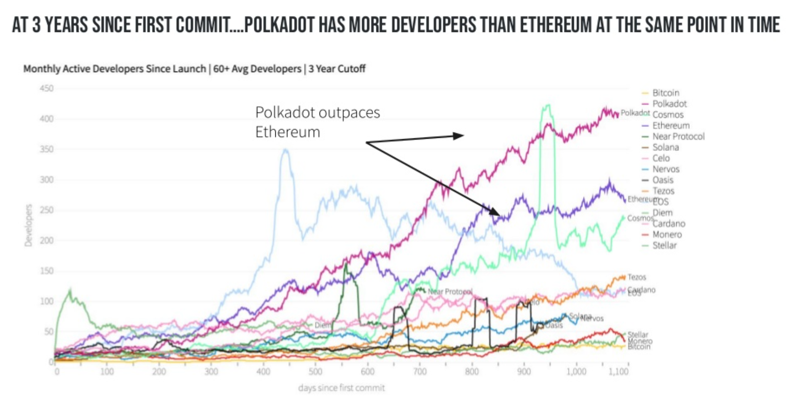
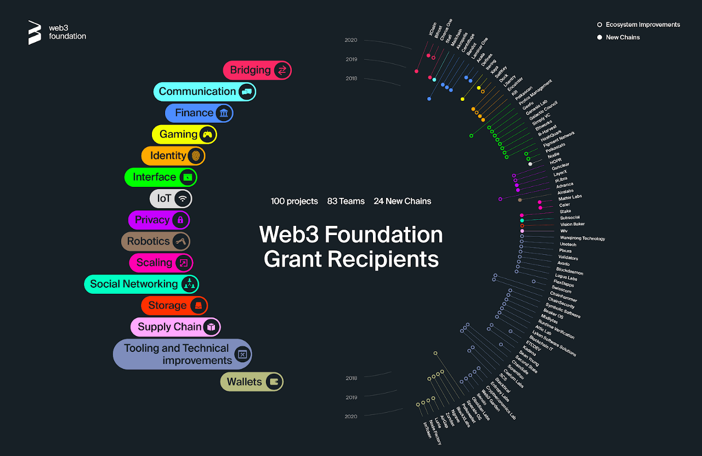

# Teck Stack

XP.network isn’t just a multi-chain bridge framework. It offers a complete toolset for creating NFT dApps, including a smart contract editor, a migration module, a testnet, and more.

## Quigon Toolkit

The Quigon consists of a series of developer-friendly modules to allow for a seamless NFT project creation process. These consist of:

1. **Multibridge** - Allows users to transfer fungible liquidity and Non-Fungible Tokens between XP.network and the bridged blockchains.
2. **Application Editor** - Allows users to configure their NFT project and overall user experience
3. **Smart Contract Editor** - Allows for customization of specific smart contract features and error debugging.
4. **Testnet** - Deployment of NFT project to specific blockchains for final user acceptance testing

All the above is made possible via the flexibility and customization that the Polkadot blockchain and Substrate framework provides.

## Why Polkadot?

We chose to build on Polkadot for several reasons:

### 1. Scalability

Polkadot achieves both horizontal scalability via Parachains as well as vertical scalability via it's BABE & GRANDA asynchronous consensus mechanisms. Parachains are able to handle as much as 1,000 TPS each, and the network as a whole once live will be able to sustain a minimum of 100,000 TPS.

### 2. Interoperability

Parachain architecture makes for seamless interoperability between other blockchains, particularly any chain which is EVM compliant can now easily be redeployed as a Polkadot Parachain, opening up more possibilities when it comes to cross-chain composability and value transfer

### 3. Substrate Architecture

Blockchains on Polkadot are custom-built and optimized for specific uses with a tool called Substrate, a low-code, developer-friendly set of tools and frameworks to abstract away the complexity involved with implementing commonly used blockchain functions.

### 4. Large Developer Ecosystem
   
The Polkadot Developer ecosystem is growing at a rapid pace and is currently outpacing that of Ethereum at the same point in it's history. This is important as it will allow projects such as ours to leverage the synergies and primitives being developed by other ecosystem projects so as to bring products to market quicker.

Polkadot is also supported by the web3 Foundation which is a growing not-for-profit organization dedicated to increasing adoption of the Polkadot network by providing grants and funding for promising up and coming projects.

