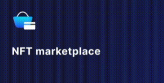
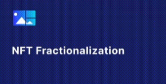
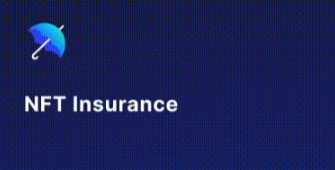

# Use Cases

Quigon enables a vast array of new NFT products and infrastructure to emerge, which will ultimately result in additional value-accrual to underlying NFT rights holders and NFT creators in general. Our philosophy is to provide simple tools to allow NFT project developers to focus on both securing and monetizing the NFT assets, without having to worry about the complexity of coding or smart contract security.

The following are just some use cases which Quigon helps bring to life.

## NFT Marketplace

Ever wanted to start a new Rarible or Nifty? This is your chance — and you define the rules, as well as the look and feel. Will there be auctions? How high the listing fees will be — if any? What color scheme will be used? And of course, remember that you can deploy the marketplace on just about any blockchain that supports smart contracts: we already have a bridge to Elrond and are working on several more.

## NFT Loans

Why should non-fungible tokens (NFTs) remain dormant in wallets? Several early-stage protocols, such as NFTfi, Lendroid, and UniLend, already allow for the use of NFTs as collateral for loans. Yours might be the next — and possibly the very first — on your preferred blockchain!

The critical issue is price discovery: you can utilize an auction model, in which users make loan offers for a particular NFT collateral, or you can employ fractionalized NFTs in the form of fungible tokens as collateral. 
Another possibility is to link to an oracle that will continuously monitor the value of an NFT (albeit such oracles do not yet exist). 

We strive to provide a variety of options in our editor, and in either case, we at XP.network feel that NFT collateralization for lending has tremendous potential for "financializing" NFTs. Quigon facilitates the emergence of a multitude of use cases whilst also standardizing widely-understood web2 primitives and introducing a web3 version.

## NFT Fractionalization

Fractionalization is the process of converting an NFT into a series of fungible tokens (ERC-20 for Ethereum-based NFTs, other types on other blockchains).

As previously mentioned, this could be the way forward for NFT-collateralized loans, as an ERC-20 will have a clear market price (making collateral calculation simple), and borrowers would be able to add additional collateral to avoid liquidation if necessary.

Another application of fractionalized NFTs (F-NFTs) is in liquidity pools, where ERC-20 fractions are used. Consider the possibility that users could earn yield farming prizes in the form of fungible tokens representing fractions of a CryptoPunk! 
Finally, fractionalisation may result in the formation of investment pools, which would let small retail investors participate in extremely expensive NFTs. Additionally, such shares, or shards, will be easy to sell.

NIFTEX, NFTX and Fractional Art have already implemented fractionalisation solutions on Ethereum, whilst Algorand enables fractionalized NFTs at the protocol level, which is rather fascinating. We hope that XP.network becomes the prototype for a suite of similar services deployed across several blockchains, and perhaps the catalyst for a true F-NFT explosion!

## NFT Insurance

When you own a multimillion-dollar piece of property, you’ll want to get it insured. And since NFTs can now be worth more than real estate or century-old paintings, they will require insurance, too. After all, there are risks associated with holding NFTs: the underlying media file can get moved or destroyed, so the NFT won’t point to anything; someone might hack your blockchain wallet; or the blockchain itself could get exploited.

Traditional insurance companies won’t underwrite such experimental digital assets, so there’s a huge window of opportunity for on-chain services and mixed CeFi/blockchain providers. Tidal Finance and Insured Finance are already working with Ethereum-based marketplaces, but as NFTs develop on other blockchains, the industry will need many more NFT insurance protocols.

## NFT Tickets

When we say that NFTs point to unique digital assets, we also mean those that are very, very similar, yet not quite identical. Event tickets are an example: each ticket has its own identification number and perhaps a seat attached to it, so it’s technically unique. Semi-fungible tokens is the correct term here, actually.

There are several advantages to issuing NFT tickets to concerts, theater plays, and the like:

1) You can prevent scalping without collecting personal data: instead of including the buyer’s name on the ticket, you can set up the smart contract in such a way that the NFTs can be re-sold trustlessly after the event.
   
2) There is no risk of fake tickets;
   
3) A ticket becomes a digital collectible and can be resold at a higher price after the event. You could even attach a royalties feature to the NFTs, so that the event organizer/musician/production company gets a reward from each transaction.
   
4) NFT holders can receive exclusive and lucrative access to post-concert items such as backstage passes, limited edition merchandise drops and discounted tickets for future concerts.