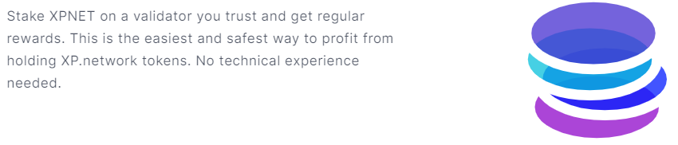
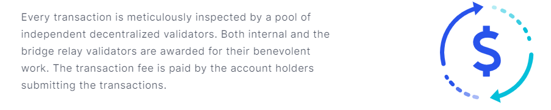
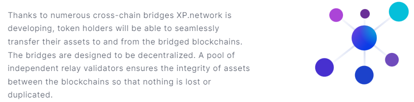
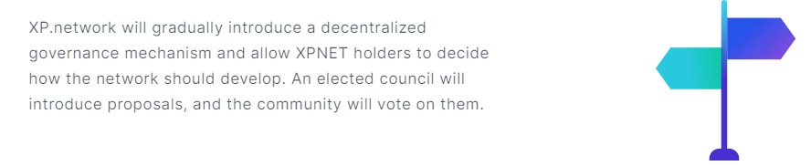
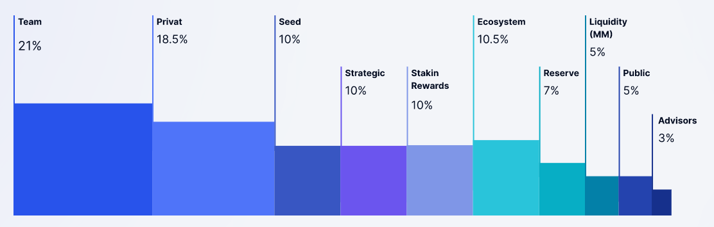
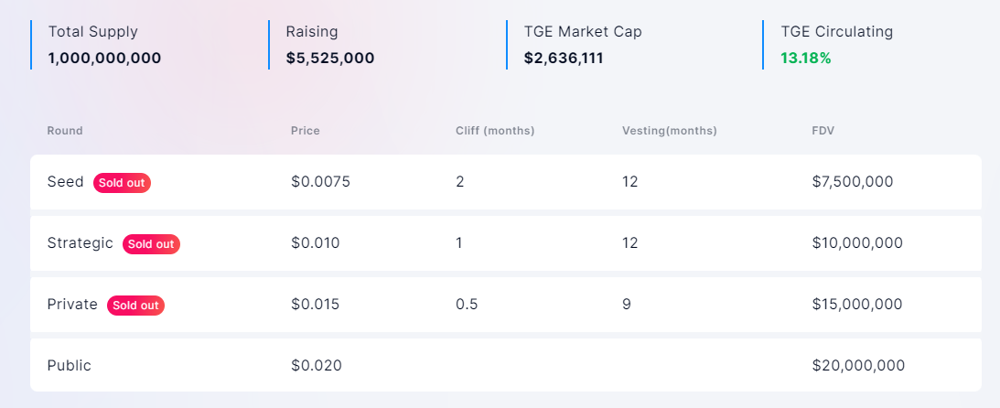

# $XPNET Token

## TOKEN FEATURES
The $XPNET token is a critical component for incentivizing and rewarding the use of the XP Network. We have taken considerable time to think through our token mechanism design to ensure that we have a healthy token velocity by balancing both supply and demand through novel utility and features.

The following sections outline these features and how they go about securing XP Network from a game-theoretic perspective.

## POA Network
Given that the project is still in it's early stages of testing and deployment, we have decided to run our blockchain via a Proof of Authority consensus mechanism in order to facilitate speedy decision making and avoid delays in mainnet deployment.

As and when the network grows we will transition over to a Proof of Stake consensus mechanism to support activities such as staking and governance, with the end goal of creating a more decentralized ecosystem.

## 01. PoS Validatio

Proof of Stake is a mechanism for allocating validators to the validator pool based on their suitability. A validator's investment in XPNET tokens increases his or her chances of being appointed to the validator pool. Validators may be supported by the stakes of the nominator. A nominator may support up to 12 validators concurrently.

This technique enables the locking of additional tokens and strengthens the system's resistance to takeover attacks. A selection method based on the entire stake will rotate the stake among the validator pool, leaving one validator active per era (24 hours). Only the active validator is permitted to sign blocks and is compensated for the transaction. If a validator is uninterested in nominators, he or she will set the commision to 100%. This signifies that the proposer will receive 0%.

Validators must be chosen with caution. When an active validator is unavailable, it signs the same blocks several times (equivocates) or commits other errors. Stakes for this validator and nominator can be cut (fined for breaking the protocol). Although a relatively small percentage of the stake is slashed to compensate for downtimes, equivocating or alternate signatures of finalised blocks can result in a 100% slash.

To avoid system takeover by advisories or centralisation, the number of equivocating nodes must be proportional to the ratio of slashes. If more than 33% of nodes equivocate, their stakes will be halved. At Genesis, there will be 100 independent validator nodes.

## 02. Staking

Nominators and validators are the two primary stakeholder groups in the XP.network. 

**Nominator**

A nominator is either a non-technical XPNET token holder who is unable to set up a validator node or a token holder who does not possess sufficient tokens to become a validator. Nominators can still earn staking rewards by delegating their token holdings to validators they trust.

**Validator**

Validators run a full XP Network node on the blockchain and participate actively in block signing and production. While validators receive transaction fees, they are personally liable for their stakes as well as the stakes of the nominators who support them. If a validator makes an error or signs fraudulent transactions on purpose, this damages one's reputation and the validator's and nominator's stakes are slashed.

**Slashing**

Slashing is a punitive measure used to penalise validators for malicious, erroneous, or incomplete work by withholding a percentage of the stake. Validators should ensure that their nodes remain operational at all times.

## 03. Transaction Security

Each transaction is painstakingly reviewed by a pool of decentralised independent validators. Internal and bridge relay validators are recognised for their charitable activities. The account holders submitting the transactions are responsible for the transaction charge.

By lowering the stakes, validator errors, lengthy response times, downtime, and deliberate fraudulent activity are discouraged. Apart from compensating validators, the transaction fee protects the transaction's security and availability.

Without the charge, anyone might flood the network with meaningless transactions or launch a distributed denial of service (DDoS) attack. The price renders such activity uneconomical, freeing up the network for well-considered lawful transactions. The transaction fee is paid prior to the completion of the transaction.

XP.network intends to allocate up to 10% of the total token supply to validators by subsidising the transaction fee at 100% from the treasury.

At the moment, the transaction fee is calculated as m * size(TX) + b, where m (multiplier) equals 0.0005 XPNET. The weight of the transaction bytecode is specified by size(TX). b is the bias value, which is set to 0.001 XPNET.

The transaction's weight is proportional to its complexity of execution and storage. The bias safeguards against flooding attacks. Transaction initiators can optionally include a tip to increase their transaction's priority in the transaction queue, hence increasing the transaction cost. In the future, token holders will vote on the transaction fee formula and rates via a public referendum.

## 04. Cross-Chain Value Transfer

Token holders will be able to smoothly transfer their assets to and from the bridged blockchains thanks to the multiple cross-chain bridges that XP.network is constructing. The bridges are dispersed in their design. A pool of independent relay validators maintains the integrity of assets transferred across blockchains, preventing them from being lost or copied.

The XPNET token will be available on the Polkadot, Elrond, HECO, Cardano, and DFINITY blockchains, among others. Once an account holder submits a request to send tokens to a bridging blockchain, the request is processed. The bridge secures the required amount in the original blockchain's smart contract and broadcasts an event.

The validators for the bridge relays capture the event and sign the transaction. The target blockchain's smart contract collects the validators' signatures. Once the 2/3*n+1 signatures are received, the equal number of wrapped tokens is released to the specified account.

The bridged blockchains' tokens can be transferred to XP.network in the same manner. XPNET can be used to purchase and sell other assets (such as NFTs), to lend and borrow, to save, and to serve as collateral.

## 05. Governance

XP.network will progressively implement a decentralised governance framework that will empower holders of the XPNET token to make executive choices on the network's future development. Once the council, elected by token holders from among the passionate token holders, makes a ruling proposal, a referendum will begin.

A sophisticated stakeholder-weighted voting mechanism will guarantee decision-making is transparent and equitable. The voter will receive more votes if there are more tokens or if the tokens are locked for a longer length of time. Following the expiration of the locking period, the locked tokens will be restored to their original wallets regardless of the referendum's outcome.

If council members vote unanimously in favour of the modification proposal's need, a negative turnout bias is applied. This means that even if fewer than 50% of voters attend, a simple majority (n percent * 3 / 5 + 1) is sufficient to pass or reject a proposal. Where n percent denotes the proportion of votes won.

If the council supports the voting proposal but not unanimously, over 51% of total token holders must vote "yes" to ensure the community's interests are protected. If a referendum results in an improvement decision, the technical committee, which is elected by the council, will upload the code implementing the change.

# TOKEN METRICS

## Allocation

There will be a total of 1,000,000,000 $XPNET issued, which will be distributed as follows:

As you can see, we want to allocate 33.5 percent of total tokens to the seed, private, and public sale stages, as well as 5% for first trading liquidity.

Although the 10% designated for the seed stage may appear excessive at first glance, a large number of institutional investors have expressed interest in XP.network, and we anticipate meeting the majority of our financial demands relatively early on.

At the same time, while the 5% earmarked for public sale is higher than many other projects in the DeFi/NFT market are charging these days, we believe in providing more consumers with the opportunity to purchase $XPNET.

## Vesting Schedule

We attempted to strike a careful balance between two factors while developing the vesting and distribution schedule:
1. The long-term stability of $XPNET on the one hand, and
2. The natural desire of any investor to realise their gains on the other. If you prematurely unlock buyers' tokens, you risk a sell-off and a price crash.

On the other hand, freezing the tokens for an extended period of time may deter many potential investors.
According to our concept, the team and advisors' $XPNET allocations will be frozen for nine months and then gradually released over the course of 36 and 12 months, respectively.

As a result, we can assure token purchasers that there will be no dump on our part. Seed investors will receive the first batch of $XPNET two months after the token production event, and the tokens will be gradually released over a 12-month period. Those who purchase during the private sale will have to wait only two weeks, albeit it will take nine months to unlock all of their tokens.